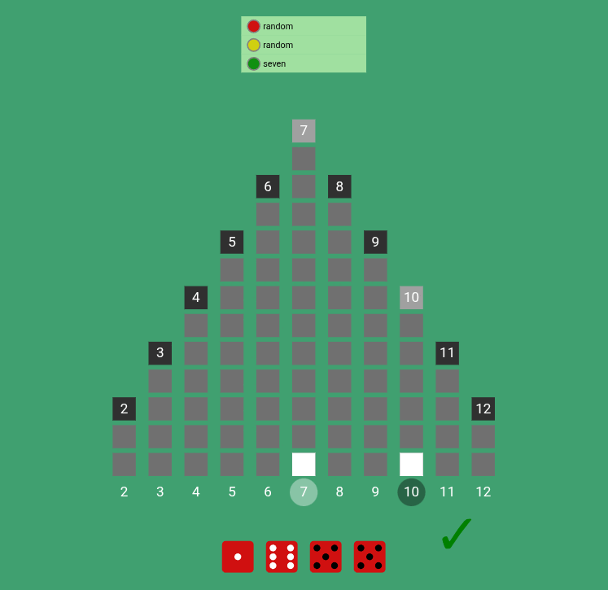
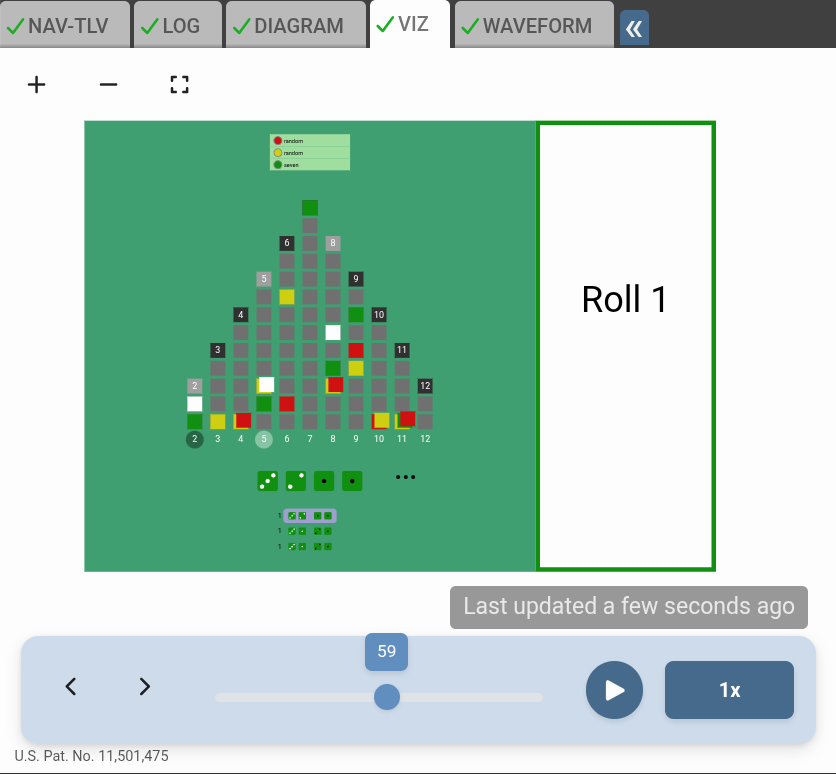

# 2nd Annual Makerchip ASIC Design Showdown, 2026

# Overview

This repository is all you need to compete in the [2nd Annual Makerchip ASIC Design Showdown](https://www.redwoodeda.com/showdown-info). Participants must monitor the `#showdown` channel in the [TL-Verilog User's Slack workspace](https://join.slack.com/t/tl-verilog-users/shared_invite/zt-4fatipnr-dmDgkbzrCe0ZRLOOVm89gA) for program updates.

This year's challenge is "Eleven Towers". Design a circuit that plays the probabilities to complete the construction of three of eleven towers before your opponents.



## Rules of the Game

Eleven Towers is based on the board game "Can't Stop", from Parker Brothers. While the rules are simple, coming up with best strategy to win consistently and codifying it in hardware is a challenge worthy of the most creative hardware engineer!

**Players:** 2-5 players (depending on template)

**Objective:** Be the first player to fully ascend three of the eleven towers.

### Turns

Play is turn-based. Each turn involves any number of rolls of the dice, until dice are passed to the next player in sequence.

### Rolls

For each roll, the active player rolls four dice and pairs them into two pairs. The sum of each pair determines the two towers the active player attempts to climb. Not all towers are eligible to climb. For each eligible pairing, the player climbs one floor of the corresponding tower, climbing two floors of the same tower if the pairs have the same sum.

If neither tower is eligible, the player "goes bust". Their progress for the turn is nullified, and they pass the dice to the next player. As long as at least one tower is eligible, the player climbs and may then choose to end their turn, banking their progress, or continue rolling.

### Climbing & Claiming Towers

A player may climb floors of at most three towers per turn. Once the player has climbed a floor of three different towers, all other towers become ineligible for the remainder of the turn. When a player has already climbed two towers during their turn, but has two eligible pairings for different towers, they must choose which one of the two towers to climb.

A player may continue to roll after reaching the apex of a tower, but that tower is no longer eligible for the remainder of the turn, though it still counts towards the player's three tower limit.

A player "claims" a tower when they end their turn at its apex. Once a tower is claimed, it becomes ineligible for all players for the remainder of the game. A player to claim three towers wins the game.

### Tower Heights

The eleven towers, corresponding to sums 2-12, have heights as follows:
- 2 & 12: 3
- 3 & 11: 5
- 4 & 10: 7
- 5 & 9: 9
- 6 & 8: 11
- 7: 13

## Showdown Structure

Depending on the number of participants, the tournament structure may vary. A sufficient number of rounds of competition will be run using different random seeds to minimize the luck factor. This is a contest of skill (due to the Law of Large Numbers). You will not know in advance how many players compete in each game, so your algorithm must be able to adjust accordingly.

## Coding Your Control Circuits

You'll construct your control logic in a copy of either:

- For TL-Verilog: `showdown_template.tlv` [[open in Makerchip](https://www.makerchip.com/sandbox?code_url=https%3A%2F%2Fraw.githubusercontent.com%2Frweda%2Fshowdown-2026-eleven-towers%2Frefs%2Fheads%2Fmain%2Fshowdown_template.tlv)]
- For plain old SystemVerilog: `showdown_verilog_template.tlv` [[open in Makerchip](https://www.makerchip.com/sandbox?code_url=https%3A%2F%2Fraw.githubusercontent.com%2Frweda%2Fshowdown-2026-eleven-towers%2Frefs%2Fheads%2Fmain%2Fshowdown_verilog_template.tlv)]

Comments in those files provide interface signal details. All you need is the one file in GitHub for submission. We suggest, using GitHub's green "Use this template" button from [this repository](https://github.com/rweda/showdown-2026-eleven-towers). Clone your new Showdown repository for local editing. Copy a template file into a new `.tlv` file in this repo for you work. (Alternatively, you could fork the repo and edit directly in the template file so you can pull future changes.)

Edit your local file in Makerchip (supported by Chrome and Edge) with auto-save. Or edit in your favorite editor, and compile in Makerchip by using "Project" > "Connect File".

## Should I use TL-Verilog or Verilog?

It's up to you. Possible reasons to use pure Verilog inlcude:

- *Familiarity:* You likely have experience with Verilog; not too many folks are experienced with the TL-Verilog language extensions yet.
- *Googleability:* There's a world of information about Verilog, while TL-Verilog learning materials are limited.
- *Marketable Skills:* Employers generally look for Verilog experience today since they don't know better.

On the other hand, TL-Verilog offers:

- *Superior Capabilities:* TL-Verilog is much more powerful and simpler. You can do more with less.
- *Easier:* You can become comfortable with it in a week. Especially, if you don't already know Verilog, it can be easier to get going with TL-Verilog. Even if you know Verilog already, you'll probably make up for your one-week investment by the time you are finished coding.
- *Advanced Skills:* Use this contest as an opportunity to learn something new and amp up your game.
- *Differentiation:* While mainstream employers look for Verilog designers, employers who are on the forefront of technology value advance skills with differentiated technology. Learning TL-Verilog could help you reach these employers and differentiate yourself from the masses.
- *Community:* This contest is associated with the TL-Verilog community. In the `#showdown` Slack channel in the [TL-Verilog User's Slack workspace](https://join.slack.com/t/tl-verilog-users/shared_invite/zt-4fatipnr-dmDgkbzrCe0ZRLOOVm89gA) you'll find a supportive community around TL-Verilog.
- *IDE Features:* This contest uses the Makerchip IDE, which is custom built to support TL-Verilog. Features like the DIAGRAM view and interactive features apply only to TL-Verilog.
- *Compatibility:* If you are on the fence, start with the TL-Verilog template and try using TL-Verilog. It is an extension of Verilog. If you have trouble, you can always write a pure Verilog component (module, macro, function, etc.) and instantiate it from your TL-Verilog code.

## Using AI

You are encouraged to use AI to assist with coding. When it comes to creativity and strategy, human ingenuity will come out on top.

AI capabilities advance almost daily. Out of the box, LLMs are more familiar with Verilog than TL-Verilog. Long term, as for humans, AI will do better with TL-Verilog.

Redwood EDA has a Makerchip VS Code extension in the works that will likely become available during the coding period. With this extension, Copilot is quite capable with TL-Verilog, and Makerchip. Prior to the release of the extension, you can connect Makerchip to an external file ("Project"::"Connect File" menu) and use any editor with an LLM assistant.

## Tips

### TL-Verilog

The WAVEFORM viewer, DIAGRAM, and NAV-TLV views in Makerchip show the entire model--the logic for the game itself, the player logic, and even the visualization code. Find your logic as `/playerX`.

Spend the time to learn TL-Verilog first, if you are not already familiar. There are learning resources in the Makerchip IDE. For this competition, you can build reasonable circuits as combinational logic, so pipelines, sequential logic, "alignment", and states are likely unimportant. Hierarchy will be useful to learn. Other tutorial topics, validity, TLV macros, and transaction flow, though they may be used heavily by the Showdown library and template, are less important for your logic.

If you don't know Verilog syntax, TL-Verilog uses Verilog expression (`assign`) syntax, so you should learn this as well. Pay careful attention to signal bit widths.

Ternary expressions are king in TL-Verilog. Make sure you understand how to use and format them cleanly.

### Verilog

In the WAVEFORM viewer, you can find your signals under `SV.team_YOUR_GITHUB_ID` (which you must rename accordingly). Sadly, the DIAGRAM only represents TL-Verilog logic.

The internet and LLMs can help you learn Verilog.

### Debugging

Assert `*passed` and/or `*failed` using, e.g., ` || *cyc_cnt > 50`, to limit simulation for testing.

### Visual Debug

You are encouraged to use Visual Debug (VIZ) to help debug your logic. Documentation is available in the Makerchip IDE under the **LEARN** menu.

#### Adding Custom Visualization

You can add a custom visualization area to your player logic to display internal state, decision-making, or strategy information. Use the following template to position this visualization to the right of the game board and render only during your turn. Visualization may be included in your final submission (at your discretion) as long as it does not obstruct the game board or display during an opponent's turn. LLMs can be quite helpful in generating VIZ code.

**Template:**

Add a `\viz_js` block like this one to your `\TLV team_*` macro:

```tlv
\TLV team_mygithubid(/_top, /_me, #player)

   // YOUR LOGIC
   /pairing[2:0]
      $score[15:0] = ...;
      $priority_pair[0:0] = ...;
   $end_turn = ...;
   
   // YOUR VIZ
   \viz_js
      // Position the visualization area to the right of the game board
      box: {width: 40, height: 100, strokeWidth: 1},
      where: {left: 50, top: 0, width: 40, height: 100},
      render() {
         // IMPORTANT! (Play nice with others.)
         // Show (with colored border) only if it's my turn.
         m5_player_color(#player)
         let o = this.getObjects()
         o.box.set({stroke: player_color})
         o.box.group.set({opacity: '$my_turn'.asBool() ? 1 : 0})
         
         // Access the roll count signal
         let rolls = '$rolls_this_turn'.asInt();
         
         // Return fabric.js objects to display
         return [
            // Roll count
            new fabric.Text(`Roll ${rolls}`, {
               left: 20, top: 40, originX: "center", originY: "center",
               fontSize: 8, fontFamily: "Roboto"
            })
         ];
      }
```



### Battling Others

The [Competition Template](./competition_template.tlv) can be used to set up a battle with an opponent.

### Seeking Help

Seek help in Slack. Help others. Competition adds to the fun, but the spirit of the competition is collaboration and community building.

If you find mistakes in the templates, Showdown library, rules, etc., please report them in Slack.

## Competition Rules

The Makerchip platform is the judge and jury for all games. The winner of each game is the first player to claim three towers. In the event no player claims three towers before Makerchip's cycle limit is reached, the winner is determined by: (1) most towers claimed, or if tied, (2) highest total tower progress across all eleven towers. Submissions that fail to compile and simulate within Makerchip's timeout will not be able to compete. Games that fail to compile/simulate will be deemed a tie or awarded to the player that was not responsible for the failure. Details of the tournament structure will be determined close to the competition date, depending upon participation.

Your submission must be based on the latest Verilog or TL-Verilog template and must not reference signals outside of your control circuit and its inputs/outputs. Bug fixes in the templates and Showdown library may be required during the coding period. Rule changes will not be introduced lightly, but may be deemed necessary to facilitate the best experience and would be communicated in Slack. Be sure you are receiving Slack notifications.

Inconsiderate behavior will not be tolerated and may result in disqualification. In the event of disputes, ambiguity, library/template bugs affecting outcomes, disqualification, etc., Redwood EDA, LLC's decisions are final and may result in loss of prize money. Details can be found in the [Showdown Terms and Conditions](https://www.redwoodeda.com/showdown-terms).
